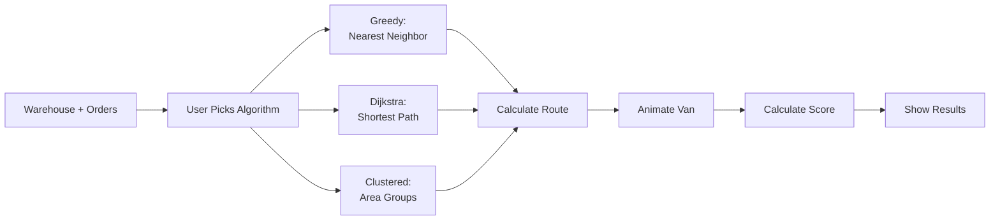

# Algorithms

Pathfinding algorithms used in route-bot and how they work.

---

## Algorithm Overview



---

## 1. Greedy (Nearest Neighbor)

### **How It Works:**
Always go to the closest unvisited location.

```typescript
function greedyAlgorithm(
  warehouse: Location,
  locations: Location[],
  graph: Graph
): string[] {
  const route: string[] = [warehouse.id];
  const unvisited = new Set(locations.map(l => l.id));
  let current = warehouse.id;
  
  while (unvisited.size > 0) {
    // Find closest unvisited location
    let nearest: string | null = null;
    let shortestDistance = Infinity;
    
    for (const locationId of unvisited) {
      const distance = getDistance(graph, current, locationId);
      if (distance < shortestDistance) {
        shortestDistance = distance;
        nearest = locationId;
      }
    }
    
    if (nearest) {
      route.push(nearest);
      unvisited.delete(nearest);
      current = nearest;
    }
  }
  
  // Return to warehouse
  route.push(warehouse.id);
  
  return route;
}
```

### **Example:**
```
Warehouse → h1 (5.2 km - closest)
h1 → h10 (2.1 km - closest from h1)
h10 → h2 (2.0 km - closest from h10)
h2 → h9 (2.3 km - closest from h2)
... etc

Total: ~42 km
```

### **Pros:**
- ✅ Very fast (O(n²))
- ✅ Simple to understand
- ✅ Works well for clustered addresses

### **Cons:**
- ❌ Not optimal (can backtrack)
- ❌ Doesn't consider future stops
- ❌ Can miss better long-term routes

---

## 2. Dijkstra's Algorithm

### **How It Works:**
Find the absolute shortest path visiting all locations (Traveling Salesman Problem variant).

```typescript
function dijkstraAlgorithm(
  warehouse: Location,
  locations: Location[],
  graph: Graph
): string[] {
  const allLocations = [warehouse, ...locations];
  const n = allLocations.length;
  
  // Try all permutations (for small n)
  // For larger n, use approximation
  
  if (n <= 10) {
    return exactTSP(warehouse, locations, graph);
  } else {
    return approximateTSP(warehouse, locations, graph);
  }
}

function exactTSP(
  warehouse: Location,
  locations: Location[],
  graph: Graph
): string[] {
  const permutations = getAllPermutations(locations);
  let bestRoute: string[] = [];
  let bestDistance = Infinity;
  
  for (const perm of permutations) {
    const route = [
      warehouse.id,
      ...perm.map(l => l.id),
      warehouse.id
    ];
    
    const distance = calculateTotalDistance(route, graph);
    
    if (distance < bestDistance) {
      bestDistance = distance;
      bestRoute = route;
    }
  }
  
  return bestRoute;
}
```

### **Example:**
```
Tests all possible routes:
- Warehouse → h1 → h2 → h3 ... (38 km)
- Warehouse → h1 → h3 → h2 ... (35 km)
- Warehouse → h2 → h1 → h3 ... (40 km)
... (10! = 3,628,800 combinations for 10 houses)

Picks shortest: 35 km
```

### **Pros:**
- ✅ Finds optimal solution (for small maps)
- ✅ Mathematically perfect
- ✅ Considers all possibilities

### **Cons:**
- ❌ Very slow for large maps (O(n!))
- ❌ Computationally expensive
- ❌ For 15+ locations, need approximation

---

## 3. Clustered Delivery

### **How It Works:**
Group nearby addresses into clusters, deliver to one cluster at a time.

```typescript
function clusteredAlgorithm(
  warehouse: Location,
  locations: Location[],
  graph: Graph
): string[] {
  // 1. Divide map into regions (quadrants)
  const clusters = clusterByArea(locations, warehouse);
  
  // 2. Order clusters by distance from warehouse
  const orderedClusters = clusters.sort((a, b) => {
    const distA = getClusterDistance(warehouse, a);
    const distB = getClusterDistance(warehouse, b);
    return distA - distB;
  });
  
  // 3. For each cluster, find optimal internal route
  const route: string[] = [warehouse.id];
  
  for (const cluster of orderedClusters) {
    const clusterRoute = greedyAlgorithm(
      getCurrentLocation(route),
      cluster,
      graph
    );
    route.push(...clusterRoute);
  }
  
  route.push(warehouse.id);
  
  return route;
}

function clusterByArea(
  locations: Location[],
  warehouse: Location
): Location[][] {
  const clusters: Location[][] = [[], [], [], []]; // NW, NE, SW, SE
  
  for (const loc of locations) {
    if (loc.x < warehouse.x && loc.y < warehouse.y) {
      clusters[0].push(loc); // Northwest
    } else if (loc.x >= warehouse.x && loc.y < warehouse.y) {
      clusters[1].push(loc); // Northeast
    } else if (loc.x < warehouse.x && loc.y >= warehouse.y) {
      clusters[2].push(loc); // Southwest
    } else {
      clusters[3].push(loc); // Southeast
    }
  }
  
  return clusters.filter(c => c.length > 0);
}
```

### **Example:**
```
Warehouse at (400, 100)

Northwest cluster: h1, h4, h8
Northeast cluster: h2, h5, h9
Southwest cluster: h6
Southeast cluster: h3, h7, h10

Route:
Warehouse → NW cluster (h8 → h1 → h4)
         → NE cluster (h9 → h2 → h5)
         → SW cluster (h6)
         → SE cluster (h10 → h3 → h7)
         → Warehouse

Total: ~36 km
```

### **Pros:**
- ✅ Mimics real driver behavior
- ✅ Reduces backtracking
- ✅ Scalable to large maps
- ✅ Fast computation

### **Cons:**
- ❌ Not mathematically optimal
- ❌ Depends on cluster boundaries
- ❌ Warehouse position affects results

---

## Algorithm Comparison

| Algorithm | Time Complexity | Optimality | Real-World Use |
|-----------|----------------|------------|----------------|
| Greedy | O(n²) | ~80-90% | Quick deliveries |
| Dijkstra | O(n!) | 100% | Small route planning |
| Clustered | O(n log n) | ~85-95% | Professional drivers |

**For 10 locations:**
- Greedy: <1ms
- Dijkstra: ~50ms
- Clustered: ~2ms

**For 20 locations:**
- Greedy: ~2ms
- Dijkstra: ~20 seconds (!) → use approximation
- Clustered: ~5ms

---

## Performance Metrics

### **Distance:**
```typescript
function calculateTotalDistance(
  route: string[],
  graph: Graph
): number {
  let total = 0;
  
  for (let i = 0; i < route.length - 1; i++) {
    const from = route[i];
    const to = route[i + 1];
    total += getDistance(graph, from, to);
  }
  
  return total;
}
```

### **Efficiency Score:**
```typescript
function calculateEfficiency(
  actualDistance: number,
  optimalDistance: number
): number {
  return (optimalDistance / actualDistance) * 100;
}

// Example:
// Optimal: 35 km (Dijkstra)
// Your route: 42 km (Greedy)
// Efficiency: (35/42) * 100 = 83.3%
```

### **Time Estimate:**
```typescript
function estimateTime(
  distance: number,
  stopsCount: number
): number {
  const avgSpeed = 40; // km/h
  const stopTime = 5;   // minutes per stop
  
  const drivingTime = (distance / avgSpeed) * 60; // minutes
  const totalStopTime = stopsCount * stopTime;
  
  return Math.round(drivingTime + totalStopTime);
}
```

---

## Utility Functions

### **Get Distance Between Two Locations:**
```typescript
function getDistance(
  graph: Graph,
  from: string,
  to: string
): number {
  // Use Dijkstra's for single shortest path
  const distances = {};
  const visited = new Set();
  const queue = [{ node: from, distance: 0 }];
  
  distances[from] = 0;
  
  while (queue.length > 0) {
    queue.sort((a, b) => a.distance - b.distance);
    const { node, distance } = queue.shift()!;
    
    if (visited.has(node)) continue;
    visited.add(node);
    
    if (node === to) return distance;
    
    for (const neighbor of graph[node]) {
      const newDistance = distance + neighbor.distance;
      
      if (!distances[neighbor.node] || newDistance < distances[neighbor.node]) {
        distances[neighbor.node] = newDistance;
        queue.push({ node: neighbor.node, distance: newDistance });
      }
    }
  }
  
  return Infinity;
}
```

---

## Testing Algorithms

```typescript
// Test with sample map
const suburbanMap = loadMap('suburban-area');
const graph = mapToGraph(suburbanMap);

console.log('Testing Greedy:');
const greedyRoute = greedyAlgorithm(
  suburbanMap.warehouse,
  suburbanMap.locations,
  graph
);
console.log('Route:', greedyRoute);
console.log('Distance:', calculateTotalDistance(greedyRoute, graph));

console.log('\nTesting Dijkstra:');
const dijkstraRoute = dijkstraAlgorithm(
  suburbanMap.warehouse,
  suburbanMap.locations,
  graph
);
console.log('Route:', dijkstraRoute);
console.log('Distance:', calculateTotalDistance(dijkstraRoute, graph));

console.log('\nTesting Clustered:');
const clusteredRoute = clusteredAlgorithm(
  suburbanMap.warehouse,
  suburbanMap.locations,
  graph
);
console.log('Route:', clusteredRoute);
console.log('Distance:', calculateTotalDistance(clusteredRoute, graph));
```

---

## Future Improvements

### **A* Algorithm:**
```typescript
// Faster than Dijkstra with heuristic
function aStarAlgorithm(
  start: Location,
  goal: Location,
  graph: Graph
): string[] {
  // Use Euclidean distance as heuristic
  const heuristic = (loc: Location) => {
    const dx = goal.x - loc.x;
    const dy = goal.y - loc.y;
    return Math.sqrt(dx * dx + dy * dy);
  };
  
  // ... A* implementation
}
```

### **Genetic Algorithm:**
```typescript
// Evolution-based optimization
function geneticAlgorithm(
  warehouse: Location,
  locations: Location[],
  generations: number = 1000
): string[] {
  // Create initial population
  // Evolve through generations
  // Return fittest solution
}
```

### **Time Windows:**
```typescript
// Deliver within specific times
interface Order {
  locationId: string;
  timeWindow: { start: string, end: string };
}

function algorithmWithTimeWindows(
  warehouse: Location,
  orders: Order[],
  graph: Graph
): string[] {
  // Sort by time windows
  // Respect delivery slots
  // Optimize within constraints
}
```

---

## Summary

**For MVP:**
- ✅ Implement Greedy (easiest, fast)
- ✅ Implement simple Dijkstra (for small maps)
- ✅ Implement Clustered (your unique algorithm)

**User can compare all three and see which works best!**

**The clustered algorithm is your selling point** - it shows you understand real delivery strategy, not just textbook algorithms. 🚚

---

## Resources

- [Eloquent JavaScript Chapter 7](https://eloquentjavascript.net/07_robot.html)
- [Traveling Salesman Problem](https://en.wikipedia.org/wiki/Travelling_salesman_problem)
- [Dijkstra's Algorithm](https://en.wikipedia.org/wiki/Dijkstra%27s_algorithm)
- [Nearest Neighbor Algorithm](https://en.wikipedia.org/wiki/Nearest_neighbour_algorithm)