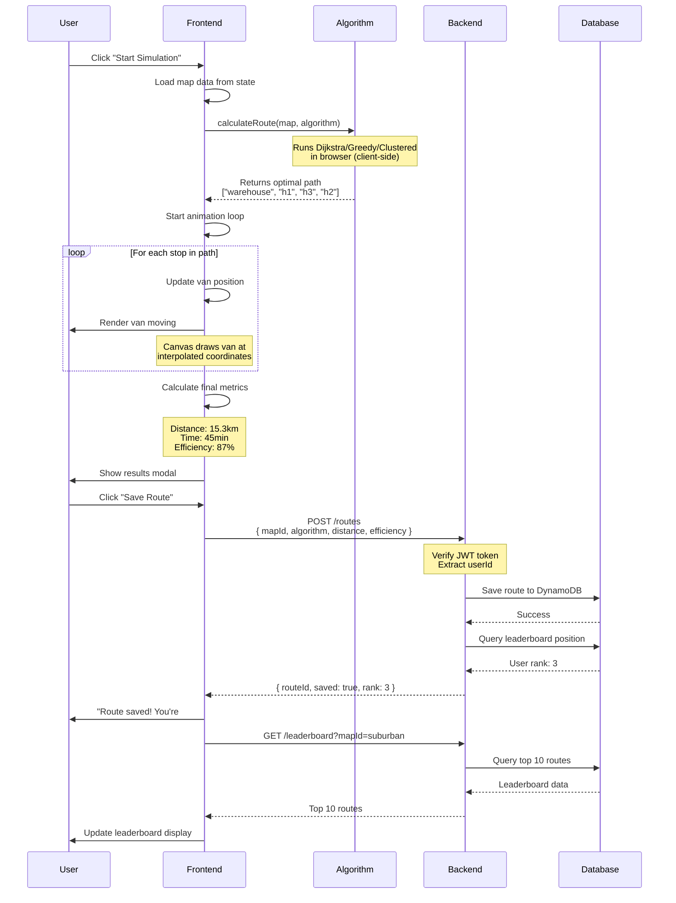
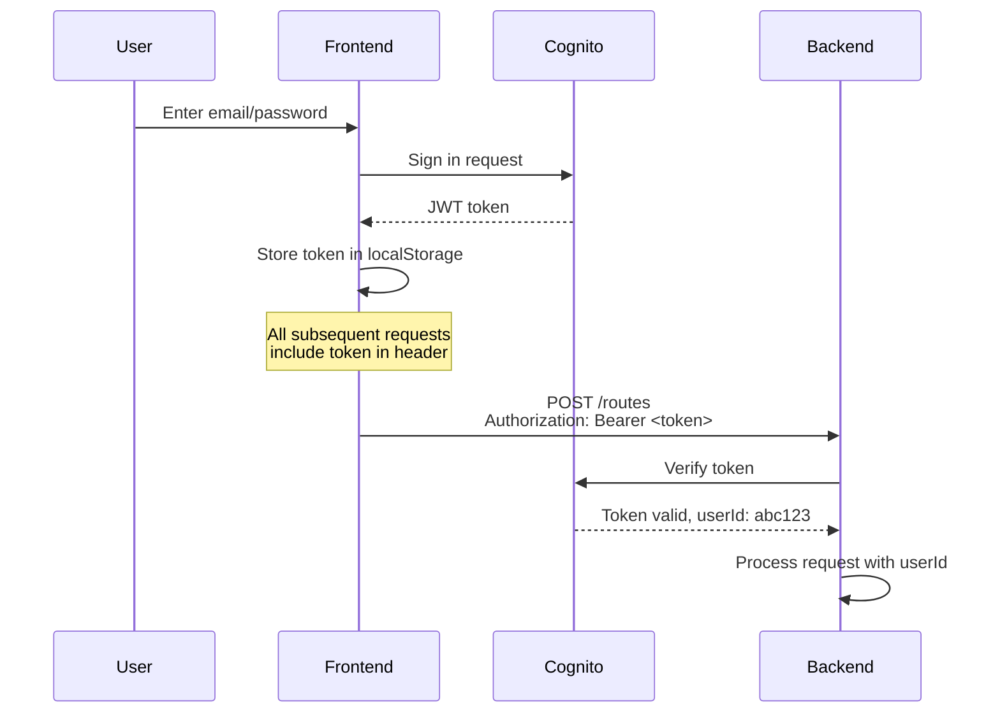
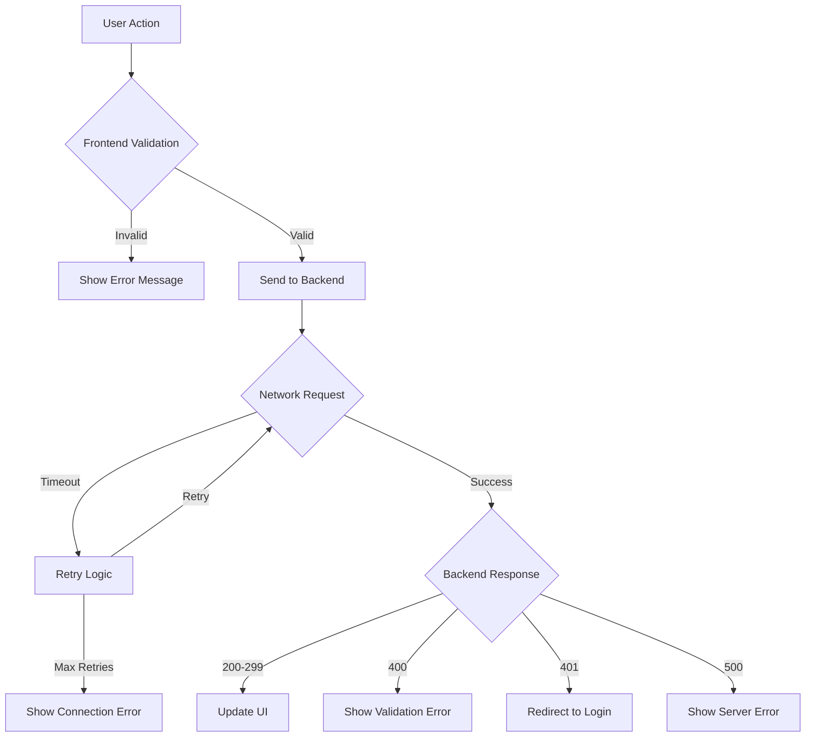
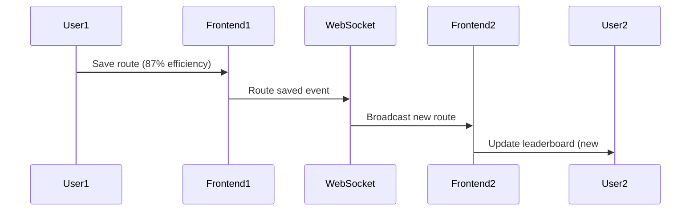

# Data Flow

How data moves through route-bot from user action to backend storage.

---

## Complete Flow: Start to Save



---

## Key Data Flow Patterns

### **1. Algorithm Execution (Client-Side)**

**Why client-side?**
- Instant feedback (no network latency)
- Free compute (runs in user's browser)
- Backend only stores results

```
User clicks Start
    ↓
Frontend loads map from memory
    ↓
Algorithm calculates in browser (< 100ms)
    ↓
Animation begins immediately
```

### **2. Authentication Flow**



### **3. Leaderboard Updates**

```
User saves route
    ↓
Backend calculates rank
    ↓
Frontend shows "You're #3!"
    ↓
Frontend fetches fresh leaderboard
    ↓
User sees their name in the list
```

---

## State Management

### **Frontend State Layers:**

```
┌─────────────────────────────────────┐
│  Global State (Context/Redux)      │
│  - authState: { user, token }      │
│  - selectedMap: Map                 │
│  - leaderboard: Route[]             │
└─────────────────────────────────────┘
           ↓
┌─────────────────────────────────────┐
│  Page State (useState)              │
│  - simulationState: running/paused  │
│  - currentRoute: Route              │
│  - vanPosition: { x, y }            │
└─────────────────────────────────────┘
           ↓
┌─────────────────────────────────────┐
│  Component State (local)            │
│  - isModalOpen: boolean             │
│  - selectedAlgorithm: string        │
└─────────────────────────────────────┘
```

**Rules:**
- Auth state: Global (needed everywhere)
- Map data: Global (shared across pages)
- Simulation state: Page-level (only Simulator page)
- UI state: Component-level (modal open/close)

---

## API Request Flow

### **Example: Saving a Route**

**1. Frontend prepares data:**
```typescript
const routeData = {
  mapId: 'suburban-area',
  algorithm: 'dijkstra',
  totalDistance: 15.3,
  totalTime: 45,
  efficiency: 87.5,
  path: ['warehouse', 'h1', 'h3', 'h2', 'warehouse']
};
```

**2. API service sends request:**
```typescript
// services/api.ts
export const saveRoute = async (routeData: RouteData) => {
  const token = localStorage.getItem('authToken');
  
  const response = await fetch(`${API_URL}/routes`, {
    method: 'POST',
    headers: {
      'Content-Type': 'application/json',
      'Authorization': `Bearer ${token}`
    },
    body: JSON.stringify(routeData)
  });
  
  return response.json();
};
```

**3. Lambda handler processes:**
```typescript
// lambda/routes.ts
export const handler = async (event) => {
  const userId = event.requestContext.authorizer.claims.sub;
  const body = JSON.parse(event.body);
  
  const route = {
    id: uuid(),
    userId,
    ...body,
    createdAt: new Date().toISOString()
  };
  
  await dynamoDB.put({
    TableName: 'Routes',
    Item: route
  });
  
  return {
    statusCode: 201,
    body: JSON.stringify({ routeId: route.id, saved: true })
  };
};
```

**4. Frontend receives response:**
```typescript
const result = await saveRoute(routeData);
// result = { routeId: 'uuid-123', saved: true, rank: 3 }

showNotification(`Route saved! You're #${result.rank} 🎉`);
```

---

## Error Handling Flow



**Example error handling:**
```typescript
try {
  const result = await saveRoute(routeData);
  showSuccess('Route saved!');
} catch (error) {
  if (error.status === 401) {
    // Token expired
    redirectToLogin();
  } else if (error.status === 400) {
    // Invalid data
    showError(error.message);
  } else {
    // Network or server error
    showError('Failed to save route. Please try again.');
  }
}
```

---

## Real-Time Updates (Future Feature)

**WebSocket flow for live leaderboard:**



**Not in MVP, but architecture supports it.**

---

## Cache Strategy

**Frontend caching:**
```typescript
// Cache map data (doesn't change often)
const cachedMaps = localStorage.getItem('maps');
if (cachedMaps && !isExpired(cachedMaps.timestamp)) {
  return JSON.parse(cachedMaps.data);
}

// Always fetch fresh leaderboard (changes frequently)
const leaderboard = await fetchLeaderboard(); // No cache
```

**Backend caching:**
- DynamoDB DAX for hot data
- CloudFront CDN for map data
- API Gateway cache for GET /maps (5 min TTL)

---

## Data Validation

### **Frontend validation (immediate feedback):**
```typescript
if (!mapId || !algorithm) {
  showError('Please select a map and algorithm');
  return;
}

if (totalDistance < 0 || totalTime < 0) {
  showError('Invalid route data');
  return;
}
```

### **Backend validation (security):**
```typescript
// Never trust client data
const schema = {
  mapId: { type: 'string', required: true },
  algorithm: { type: 'string', enum: ['dijkstra', 'greedy', 'clustered'] },
  totalDistance: { type: 'number', min: 0 },
  efficiency: { type: 'number', min: 0, max: 100 }
};

if (!validate(body, schema)) {
  return { statusCode: 400, body: 'Invalid request' };
}
```

---

## Performance Optimizations

**1. Debounce API calls:**
```typescript
// Don't spam backend while user is still interacting
const debouncedSave = debounce(saveRoute, 500);
```

**2. Batch requests:**
```typescript
// Get user profile + leaderboard in one request
const [profile, leaderboard] = await Promise.all([
  getProfile(),
  getLeaderboard()
]);
```

**3. Lazy load maps:**
```typescript
// Only load map data when user selects it
const map = await loadMap(selectedMapId);
```

---

## Summary: Critical Paths

**Most important flows to understand:**

1. ✅ **Simulation:** User clicks → Algorithm runs → Animation plays
2. ✅ **Save Route:** User saves → Backend validates → Database stores
3. ✅ **Auth:** User logs in → Token stored → Subsequent requests authenticated

**Master these 3 flows and you understand the entire app.** 🎯