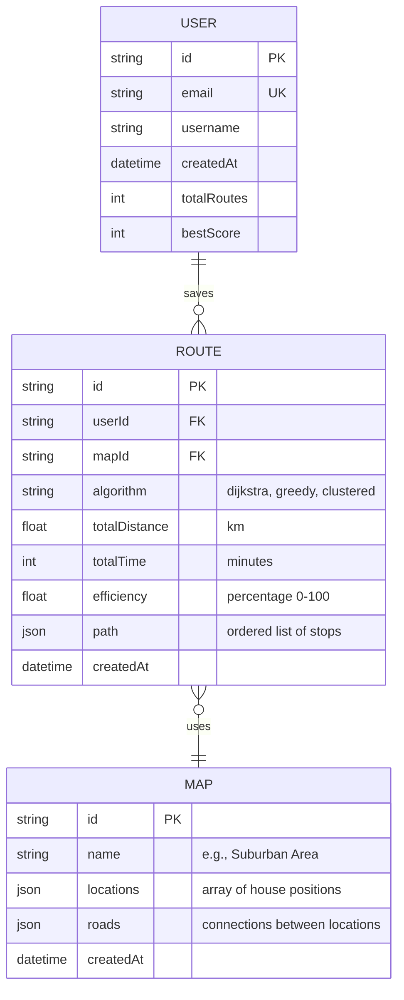

# Database Schema

Entity Relationship Diagram showing the data structure for route-bot.

---

## ERD



---

## Table Descriptions

### **Users Table**

Stores user account information.

| Field | Type | Description |
|-------|------|-------------|
| id | String (UUID) | Primary key |
| email | String | Unique user email |
| username | String | Display name |
| createdAt | DateTime | Account creation timestamp |
| totalRoutes | Integer | Total routes completed |
| bestScore | Integer | Highest efficiency score |

**DynamoDB Setup:**
- Partition Key: `id`
- Global Secondary Index: `email`

---

### **Maps Table**

Stores map configurations with locations and roads.

| Field | Type | Description |
|-------|------|-------------|
| id | String | Primary key (e.g., "suburban-area") |
| name | String | Display name |
| locations | JSON | Array of delivery locations |
| roads | JSON | Array of road connections |
| createdAt | DateTime | Map creation timestamp |

**DynamoDB Setup:**
- Partition Key: `id`

**Example locations JSON:**
```json
[
  { "id": "warehouse", "x": 400, "y": 100, "name": "Warehouse", "type": "warehouse" },
  { "id": "h1", "x": 200, "y": 300, "name": "15 Maple Dr", "type": "house" },
  { "id": "h2", "x": 600, "y": 300, "name": "42 Oak Ln", "type": "house" }
]
```

**Example roads JSON:**
```json
[
  { "from": "warehouse", "to": "h1", "distance": 5.2 },
  { "from": "warehouse", "to": "h2", "distance": 7.1 },
  { "from": "h1", "to": "h2", "distance": 3.5 }
]
```

---

### **Routes Table**

Stores completed delivery routes and scores.

| Field | Type | Description |
|-------|------|-------------|
| id | String (UUID) | Primary key |
| userId | String | Foreign key to Users |
| mapId | String | Foreign key to Maps |
| algorithm | String | Algorithm used (dijkstra/greedy/clustered) |
| totalDistance | Float | Total distance in km |
| totalTime | Integer | Total time in minutes |
| efficiency | Float | Efficiency score (0-100) |
| path | JSON | Ordered array of location IDs |
| createdAt | DateTime | Route completion timestamp |

**DynamoDB Setup:**
- Partition Key: `userId`
- Sort Key: `createdAt`
- Global Secondary Index: `mapId` (for leaderboards)

**Example path JSON:**
```json
["warehouse", "h1", "h3", "h2", "h5", "warehouse"]
```

---

## Relationships

- **User → Routes**: One-to-Many (a user can save many routes)
- **Map → Routes**: One-to-Many (a map can have many routes completed on it)

---

## Indexes for Performance

### **Routes Table GSI (for Leaderboards):**
- Partition Key: `mapId`
- Sort Key: `efficiency` (descending)
- Allows fast queries: "Get top 10 routes for Suburban Area map"

### **Users Table GSI (for Login):**
- Partition Key: `email`
- Allows fast lookup by email during authentication

---

## Sample Queries

**Get user's routes:**
```typescript
const routes = await dynamoDB.query({
  TableName: 'Routes',
  KeyConditionExpression: 'userId = :userId',
  ExpressionAttributeValues: { ':userId': userId }
});
```

**Get leaderboard for a map:**
```typescript
const leaderboard = await dynamoDB.query({
  TableName: 'Routes',
  IndexName: 'mapId-efficiency-index',
  KeyConditionExpression: 'mapId = :mapId',
  ScanIndexForward: false, // Descending order
  Limit: 10
});
```

**Get map data:**
```typescript
const map = await dynamoDB.get({
  TableName: 'Maps',
  Key: { id: 'suburban-area' }
});
```

---

## Migration Notes

All tables use DynamoDB's automatic timestamping via CDK:
```typescript
removalPolicy: RemovalPolicy.RETAIN
```

For development, use `DESTROY` to allow easy table recreation.