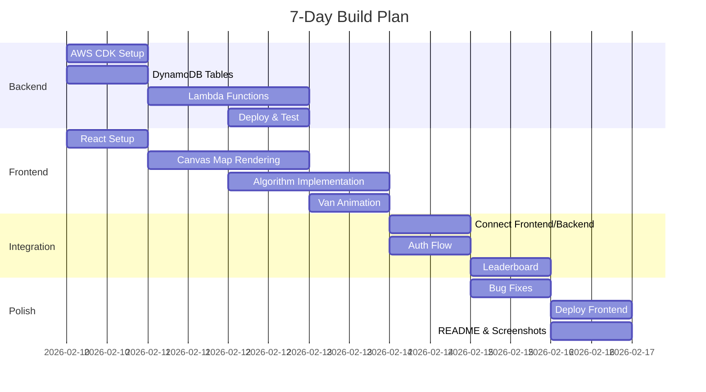

# Week Plan

7-day development timeline for route-bot MVP.

---

## Overview



---

## Day 1: Setup & Foundation

### **Morning: Backend Setup (3-4 hours)**

**Tasks:**
1. ✅ Install AWS CLI and configure credentials
2. ✅ Create `route-bot-backend` repo
3. ✅ Initialize CDK project
4. ✅ Create basic stack structure

**Commands:**
```bash
mkdir route-bot-backend
cd route-bot-backend
cdk init app --language=typescript
npm install
```

**Files to create:**
- `lib/route-bot-stack.ts` - Main CDK stack
- `bin/route-bot.ts` - Entry point

**Deliverable:** CDK app that deploys empty stack

---

### **Afternoon: Frontend Setup (3-4 hours)**

**Tasks:**
1. ✅ Create `route-bot-frontend` repo
2. ✅ Initialize Vite + React + TypeScript
3. ✅ Install dependencies (Tailwind, React Router)
4. ✅ Create basic file structure

**Commands:**
```bash
npm create vite@latest route-bot-frontend -- --template react-ts
cd route-bot-frontend
npm install
npm install -D tailwindcss postcss autoprefixer
npm install react-router-dom
```

**Files to create:**
- `src/pages/Home.tsx`
- `src/pages/Simulator.tsx`
- `src/types/map.ts`
- `src/types/route.ts`

**Deliverable:** React app running on `localhost:5173`

---

**End of Day 1:**
- ✅ Both repos created
- ✅ CDK deploys successfully
- ✅ React app runs locally
- ✅ Basic folder structure in place

---

## Day 2: Database + Core UI

### **Morning: DynamoDB Tables (2-3 hours)**

**Tasks:**
1. ✅ Define Users table in CDK
2. ✅ Define Routes table in CDK
3. ✅ Define Maps table in CDK
4. ✅ Deploy tables to AWS

**Code:**
```typescript
// In lib/route-bot-stack.ts
const usersTable = new dynamodb.Table(this, 'Users', {
  partitionKey: { name: 'id', type: dynamodb.AttributeType.STRING }
});

const routesTable = new dynamodb.Table(this, 'Routes', {
  partitionKey: { name: 'userId', type: dynamodb.AttributeType.STRING },
  sortKey: { name: 'createdAt', type: dynamodb.AttributeType.STRING }
});
```

**Test:** Check tables exist in AWS Console

---

### **Afternoon: Canvas Map Rendering (4-5 hours)**

**Tasks:**
1. ✅ Create `MapCanvas.tsx` component
2. ✅ Draw static map (warehouse, houses, roads)
3. ✅ Create sample map data
4. ✅ Test rendering

**Code:**
```typescript
// src/components/Map/MapCanvas.tsx
export function MapCanvas({ map }: { map: Map }) {
  const canvasRef = useRef<HTMLCanvasElement>(null);
  
  useEffect(() => {
    const canvas = canvasRef.current;
    const ctx = canvas?.getContext('2d');
    if (!ctx) return;
    
    // Draw roads
    map.roads.forEach(road => {
      // ... draw lines
    });
    
    // Draw locations
    map.locations.forEach(loc => {
      // ... draw circles
    });
  }, [map]);
  
  return <canvas ref={canvasRef} width={800} height={700} />;
}
```

**Deliverable:** Static map visible on screen

---

**End of Day 2:**
- ✅ Database tables deployed
- ✅ Map renders on canvas
- ✅ Sample map data created

---

## Day 3: Lambda Functions + Algorithms

### **Morning: Lambda Functions (3-4 hours)**

**Tasks:**
1. ✅ Create `lambda/routes.ts` (save/get routes)
2. ✅ Create `lambda/maps.ts` (get map data)
3. ✅ Add Lambda functions to CDK stack
4. ✅ Create API Gateway endpoints

**Code:**
```typescript
// lambda/routes.ts
export const handler = async (event: any) => {
  const method = event.requestContext.http.method;
  
  if (method === 'POST') {
    // Save route
    const body = JSON.parse(event.body);
    await dynamoDB.put({ TableName: 'Routes', Item: body });
    return { statusCode: 201, body: JSON.stringify({ saved: true }) };
  }
  
  if (method === 'GET') {
    // Get routes
    const result = await dynamoDB.query({ TableName: 'Routes', ... });
    return { statusCode: 200, body: JSON.stringify(result.Items) };
  }
};
```

**Test:** Use Postman to test endpoints

---

### **Afternoon: Implement Greedy Algorithm (3-4 hours)**

**Tasks:**
1. ✅ Create `engine/algorithms/greedy.ts`
2. ✅ Implement nearest neighbor logic
3. ✅ Test with sample map
4. ✅ Display route in console

**Code:**
```typescript
// engine/algorithms/greedy.ts
export function greedyAlgorithm(
  warehouse: Location,
  locations: Location[],
  graph: Graph
): string[] {
  const route = [warehouse.id];
  const unvisited = new Set(locations.map(l => l.id));
  let current = warehouse.id;
  
  while (unvisited.size > 0) {
    let nearest = findNearest(current, unvisited, graph);
    route.push(nearest);
    unvisited.delete(nearest);
    current = nearest;
  }
  
  route.push(warehouse.id);
  return route;
}
```

**Deliverable:** Algorithm returns valid route

---

**End of Day 3:**
- ✅ API endpoints deployed and tested
- ✅ Greedy algorithm working
- ✅ Can calculate routes

---

## Day 4: Animation + More Algorithms

### **Morning: Van Animation (3-4 hours)**

**Tasks:**
1. ✅ Create animation loop
2. ✅ Move van between points
3. ✅ Update stats panel during movement
4. ✅ Add start/pause/reset buttons

**Code:**
```typescript
// engine/simulator.ts
export class Simulator {
  private animationId: number | null = null;
  private currentStep = 0;
  
  start(route: string[]) {
    const animate = () => {
      // Update van position
      // Redraw canvas
      // Check if finished
      this.animationId = requestAnimationFrame(animate);
    };
    animate();
  }
  
  pause() {
    if (this.animationId) {
      cancelAnimationFrame(this.animationId);
    }
  }
}
```

**Deliverable:** Van moves visibly on map

---

### **Afternoon: Implement Dijkstra + Clustered (3-4 hours)**

**Tasks:**
1. ✅ Create `algorithms/dijkstra.ts`
2. ✅ Create `algorithms/clustered.ts`
3. ✅ Add algorithm selector UI
4. ✅ Compare results of all three

**Deliverable:** User can pick algorithm and see different routes

---

**End of Day 4:**
- ✅ Van animation working
- ✅ All 3 algorithms implemented
- ✅ User can compare algorithms

---

## Day 5: Integration

### **Morning: Auth Setup (3-4 hours)**

**Tasks:**
1. ✅ Add Cognito User Pool in CDK
2. ✅ Create `lambda/auth.ts`
3. ✅ Create login/signup forms
4. ✅ Store JWT token in localStorage

**Code:**
```typescript
// lambda/auth.ts
import { CognitoIdentityServiceProvider } from 'aws-sdk';
const cognito = new CognitoIdentityServiceProvider();

export const handler = async (event: any) => {
  const { email, password } = JSON.parse(event.body);
  
  const result = await cognito.initiateAuth({
    AuthFlow: 'USER_PASSWORD_AUTH',
    ClientId: process.env.COGNITO_CLIENT_ID!,
    AuthParameters: { USERNAME: email, PASSWORD: password }
  }).promise();
  
  return { statusCode: 200, body: JSON.stringify(result) };
};
```

**Deliverable:** User can sign up and log in

---

### **Afternoon: Connect Frontend to Backend (3-4 hours)**

**Tasks:**
1. ✅ Create `services/api.ts`
2. ✅ Call save route endpoint
3. ✅ Display success message
4. ✅ Handle errors

**Code:**
```typescript
// services/api.ts
export const api = {
  async saveRoute(routeData: RouteData) {
    const token = localStorage.getItem('token');
    const response = await fetch(`${API_URL}/routes`, {
      method: 'POST',
      headers: {
        'Authorization': `Bearer ${token}`,
        'Content-Type': 'application/json'
      },
      body: JSON.stringify(routeData)
    });
    return response.json();
  }
};
```

**Deliverable:** Routes save to database

---

**End of Day 5:**
- ✅ Authentication working
- ✅ Frontend calls backend
- ✅ Routes save successfully

---

## Day 6: Leaderboard + Polish

### **Morning: Leaderboard (3-4 hours)**

**Tasks:**
1. ✅ Create `lambda/leaderboard.ts`
2. ✅ Query DynamoDB for top routes
3. ✅ Create `Leaderboard.tsx` page
4. ✅ Display rankings

**Code:**
```typescript
// lambda/leaderboard.ts
export const handler = async (event: any) => {
  const { mapId } = event.queryStringParameters;
  
  const result = await dynamoDB.query({
    TableName: 'Routes',
    IndexName: 'mapId-efficiency-index',
    KeyConditionExpression: 'mapId = :mapId',
    ExpressionAttributeValues: { ':mapId': mapId },
    ScanIndexForward: false, // Descending
    Limit: 10
  }).promise();
  
  return { statusCode: 200, body: JSON.stringify(result.Items) };
};
```

**Deliverable:** Leaderboard shows top 10 routes

---

### **Afternoon: Bug Fixes + UX (3-4 hours)**

**Tasks:**
1. ✅ Fix any animation glitches
2. ✅ Add loading indicators
3. ✅ Improve error messages
4. ✅ Test on different browsers
5. ✅ Mobile responsiveness

**Deliverable:** App feels polished

---

**End of Day 6:**
- ✅ Leaderboard working
- ✅ Major bugs fixed
- ✅ UX improvements

---

## Day 7: Deploy + Documentation

### **Morning: Deployment (2-3 hours)**

**Tasks:**
1. ✅ Deploy frontend to Vercel
2. ✅ Configure environment variables
3. ✅ Test production build
4. ✅ Fix any deployment issues

**Commands:**
```bash
# Frontend
npm run build
vercel --prod

# Backend (already deployed)
cdk deploy --all
```

**Deliverable:** Live URLs for both frontend and backend

---

### **Afternoon: Documentation (3-4 hours)**

**Tasks:**
1. ✅ Write comprehensive README
2. ✅ Take screenshots/GIFs
3. ✅ Add demo link
4. ✅ Document API endpoints
5. ✅ Create architecture diagrams

**README sections:**
- Project overview
- Features
- Tech stack
- Live demo link
- Local development setup
- Screenshots
- Your story (delivery driver)

**Deliverable:** Professional README

---

**End of Day 7:**
- ✅ App deployed and live
- ✅ README complete
- ✅ Ready to share with recruiters

---

## Success Checklist

**MVP Requirements:**
- [ ] User can sign up/login
- [ ] User can select a map
- [ ] User can pick algorithm (Greedy/Dijkstra/Clustered)
- [ ] Van animates along route
- [ ] Stats show distance/time/efficiency
- [ ] User can save route
- [ ] Leaderboard shows rankings
- [ ] App is deployed
- [ ] README has screenshots

**If you have all checkboxes: YOU'RE DONE! 🎉**

---

## Contingency Plan

**If behind schedule:**

**Skip:**
- Clustered algorithm (keep Greedy + Dijkstra)
- Custom maps (use 1 hardcoded map)
- Leaderboard (just save routes)

**Must have:**
- One working algorithm
- Van animation
- Save routes
- Deployed

**Minimum viable: 5 days instead of 7**

---

## Daily Time Commitment

**Ideal:** 6-8 hours/day
**Minimum:** 4-5 hours/day

**Total time:** 35-50 hours for MVP

---

## Motivation

**This week you're building:**
- ✅ Full-stack app
- ✅ AWS infrastructure
- ✅ Algorithm visualizer
- ✅ Your ticket to interviews

**One week from now:**
- CV updated ✅
- Portfolio project live ✅
- Messaging recruiters ✅
- Getting interviews ✅

**Let's go! 🚀**